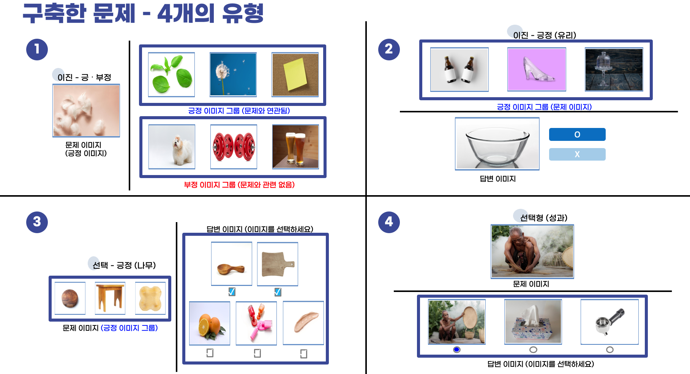

# Large Scale Visual Reasoning Dataset
대규모 시각 추론 데이터셋은 [NIA](https://www.nia.or.kr/site/nia_kor/main.do)와 [EUCLIDSOFT](https://www.euclidsoft.co.kr/)가 구축한 대규모 이미지 데이터셋이다.

## Example  


## 모델 실행 예시 코드   
### Dependency
1. 다음 명령어를 통해 필요한 패키지를 설치:
```
pip install -r requirements.txt
```
2. 데이터셋은 추후 [AI-Hub](https://www.aihub.or.kr/)에 공개 예정

## Traning(Classification_Train.py, SimCLR_Train.py, SupCLR_Train.py)  
사용 예시:
```
python Classification_Train.py \
    --train_link 'data/train_data' \
    --valid_link 'data/valid_data' \
    --task 1 \
    --category 2
```  
다음과 같이 하이퍼파라미터를 조정 가능합니다:
```
python Classification_Train.py \
    --input_dim 512 \
    --mlp_hidden 256 \
    --batch_size 128 \
    --model_name 'resnet50' \
    --mode 'train' \
    --num_workers 4 \
    --devices '0,1,2,3' \
    --epochs 10 \
    --clr_temperature 10 \
    --learning_rate 0.001 \
    --log_every_n_steps 100 \
    --model_save_path 'ckpt/save_dir' \
    --freeze \
    --resume_from_checkpoint 'ckpt/checkpoint_dir' \
    --train_link 'data/train_data' \
    --valid_link 'data/valid_data' \
    --task 1 \
    --category 2
```  

## Evaluation
추후 공개 예정
  
 
## Citation
Please cite the repo if you use the data or code in this repo.
```
@misc{Visual-Reasoning,
  author = {MLP Lab},
  title = {Large Scale Visual Reasoning Dataset},
  year = {2023},
  publisher = {GitHub},
  journal = {GitHub repository},
  howpublished = {\url{https://github.com/ChangSu-Choi/Visual-Reasoning}},
}
```
